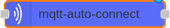
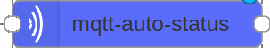
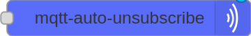
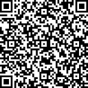

# node-red-contrib-mqtt-auto 📜

This node is intended to facilitate connection and change of connection credentials at runtime.

## Nodes ☕️

Diga adeus aos perfis sem graça. Com nossos **[templates de perfil](https://github.com/iuricode/readme-template/tree/main/perfil)**, você terá um readme de perfil íncrivel. Com cores vibrantes,imagens surpreendentes e outros elementos visuais cativantes.

### mqtt-auto-connect



```
msg.payload = {

  "client_id": "clientid",
  "host": "locahost",
  "user": "user",
  "password": "password",
  "reconnect_t" : 1, // 0 No Reconect  1 AutoReconnect
};
```


### mqtt-auto-disconnect


```
msg.client_id = "client_id";
```

### mqtt-auto-status




### mqtt-auto-subscribe


```
msg.client_id = "client_id";
msg.topic = "topic";
```


### mqtt-auto-unsubscribe



```
msg.client_id = "client_id";
msg.topic = "topic";
```


## Thanks 🔥


This project was based on the project of **[promd76](https://www.npmjs.com/~promd76)**

## Donate ☕️

If this project was useful to you, help me continue developing and drinking a coffee while I'm coding.

<p>
  <a href="https://www.paypal.com/donate/?business=A7LJZ2W82R8NQ&no_recurring=0&item_name=Me+ajuda+com+meu+cafezinho.%0Acollaborate+with+my+coffee.&currency_code=BRL">
      

  </a>
</p>


|  |  |
|-------------------------------|----------------------------------|
|       GRCode PIX              | GRCode PayPal                    |
